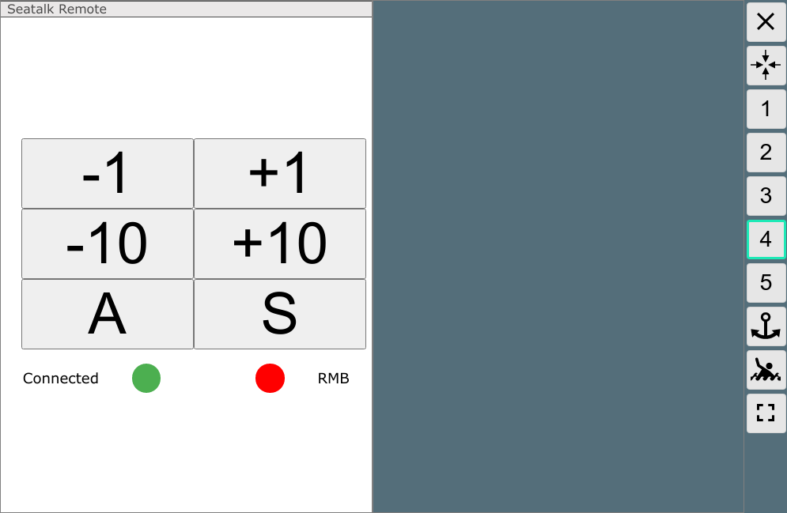

AvNav Seatalk Remote Control
===========================

This project provides a plugin for [AvNav](https://www.wellenvogel.net/software/avnav/docs/beschreibung.html?lang=en) that controls the Seatalk Remote control provided by [AK-Homberger](https://github.com/AK-Homberger/Seatalk-Autopilot-Remote-Control).

The project is based on ideas from a discussion in the (german) [Segeln Forum](https://www.segeln-forum.de/board194-boot-technik/board35-elektrik-und-elektronik/board195-open-boat-projects-org/78360-verkn%C3%BCpfung-von-avnav-%C3%BCber-mcs-mit-pinnenpilot/#post2241795).

Basically this software uses the [AvNav Plugin Interface](https://www.wellenvogel.net/software/avnav/docs/hints/plugins.html?lang=en) to provide a Widget (SeatalkRemote) that can be displayed inside AvNav (configure it with the [layout editor](https://www.wellenvogel.net/software/avnav/docs/hints/layouts.html?lang=en)).



Installation
------------
You can use the plugin in 2 different ways.
1.  Download the source code as a zip and unpack it into a directory /home/pi/avnav/data/plugins/seatalk-remote.
    In this case the name of the plugin will be user-setalk-remote. You can change the files and adapt it to your needs.

1.  Download the package provided in the releases section or build your own package using buildPackage.sh (requires a linux machine with docker installed). Install the package using the command
    ```
    sudo dpkg -i avnav-seatalk-remote-plugin...._all.deb
    ```

Configuration
-------------
You need to configure the serial interface (USB port) that you will use to connect to the Arduino. Therefore within avnav_server.xml below AVNPluginHandler you need a configuration for the plugin.
```
<AVNPluginHandler>
  <user-seatalk-remote usbid="3-2.2:1.0"/>
</AVNPluginHandler>
```
Just consider that typically there will be some other entries below the AVNPluginHandler already - just take care to only have one AVNPluginHandler.
In the example the plugin was downloaded as zip and installed into /home/pi/avnav/data/plugins/seatalk-remote.
The usbid configuration is the same as used for [AVNUsbSerialReader](https://www.wellenvogel.net/software/avnav/docs/hints/configfile.html?lang=en#h3:AVNUsbSerialReader). With this setting the AVNUsbSerialReader will automatically skip the usb devices with this id. It requires AvNav in a version >= 20201227.
As an alternative you could use
```
<AVNPluginHandler>
  <user-seatalk-remote device="/dev/serial/by-path/platform-3f980000.usb-usb-0:1.4:1.0-port0"/>
</AVNPluginHandler>
```
In this case you need to tell the AVNUsbSerialReader to skip this particular device.
```
<AVNUsbSerialReader ....
....
<UsbDevice baud="38400" type="ignore" usbid="1-1.4:1.0"/>
...
```
If you install with the package you need to replace *user-seatalk-remote* with *system-seatalk-remote* in the configuration.
You can additionally provide a baud="nnnn" parameter to change the baudrate for the Arduino connection (9600 is the default),

Implementation Details
----------------------

The [python part](plugin.py) reads the configuration, potentially registers the USB device and registers itself for HTTP API requests.
It spawns an own thread that tries to open the serial device and monitors it to detected when it is closed.
In the method handleApiRequest the communication with the [widget](plugin.js)is handled. There are 2 requests:
request | function
--------|---------
..../api/status | return a json object with status=OK,connected,hasRmb,device
..../api/keyxx | handles a key press. xx can be p1,p10,m1,m10,A,S. A json object with status=XXX is returned.

When sending the commands to the arduino (sendCommand) it is ensured that only one thread at a time will succeed in sending, others will immediately return with status=busy to avoid blocking all http threads if the communication takes some time.

Additionally the python part monitors the NMEA data stream of AvNav and checks if there are RMB sentences. If there is at least one RMB within 3 seconds, it will respond with hasRmb=true on status requests. This way the widget can show if the AP can be driven by NMEA data.

The [widget (js) part](plugin.js) starts an interval timer in it's initFunction that calls the .../api/status every second and stores the retrieved values. Whenever some value changes, a redraw of the widget is triggered.
Additionally an event handler is registered, that will be called when a button is clicked - refer to the [documentation](https://www.wellenvogel.net/software/avnav/docs/hints/userjs.html?lang=en#h1:UserSpezificJavaScriptCode).
The key that a button should trigger is stored in a data-key attribute at the button.
When the plugin is responding to the button click, the status badge is drawn red or green depending on the status and is cleared with a timer.
In the renderHtml the buttons and the status items are provided as a HTML string. Colouring is done by assigning additional classes to the items - so all the styling can easily be done in the [css](plugin.css).

Package Building
----------------
For a simple package building [NFPM](https://nfpm.goreleaser.com/) is used and started in a docker container (use [buildPkg.sh](buildPkg.sh)). In the [package.yaml](package.yaml) the properties of the packge can be set. 

Additionally a [GitHub workflow](.github/workflows/createPackage.yml) has been set up to create a release and build a package whenever you push to the release branch.
So when you fork this repository you can create a package even without a local environment.